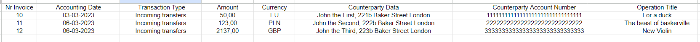
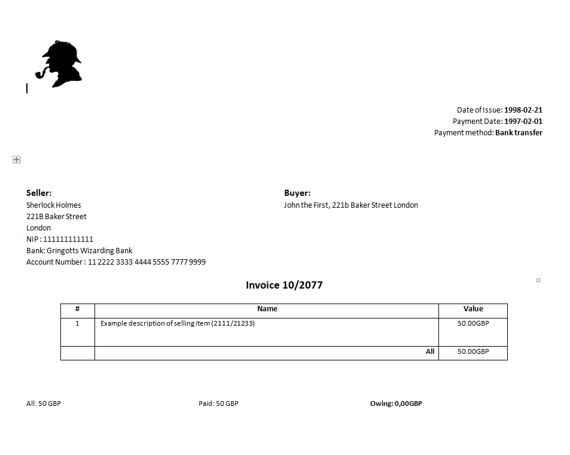

# InvoiceGenerator
InvoiceGenerator is a tool used for big generation of invoices based on an .xls file containing invoice data in each row and saving them in one docx file for easy print.

## Study Case
I created this generator because I needed to generate over 120 invoices based on information contained in an Excel file. Below is an example of the data:

The goal was to generate an original page in a docx file for each row.
Example page below:


## Usage
The main library used in this project is **python-docx**. Unfortunately, I encountered some issues when using it with Python 3.9, but it works fine with **Python 3.8**.

Here is a list of libraries I have used:
 - *et-xmlfile	1.1.0	1.1.0*
- *lxml	4.9.2	4.9.2*
- *numpy	1.24.4	1.25.0*
- *openpyxl	3.1.2	3.1.2*
- *pandas	2.0.3	2.0.3*
- *pip	23.1.2	23.1.2*
- *python-dateutil	2.8.2	2.8.2*
- *python-docx	0.8.11	0.8.11*
- *python-docx-2023	0.2.17	0.2.17*
- *pytz	2023.3	2023.3*
- *setuptools	68.0.0	68.0.0*
- *six	1.16.0	1.16.0*
- *tzdata	2023.3	2023.3*
- *xlrd	2.0.1	2.0.1 *

and a helpful link to the python-docx documentation:
https://python-docx.readthedocs.io/en/latest/index.html

### main.py
Here is simple `main.py` with elements that you could see in example image above
```python 
document = Document()  #creating empty document

set_margins(document)

asd = BankTransfers() 
asd.load_excel() #creating class containg every Bank Transfer from excel file

for bt in asd.bank_transfers:
    bt.print()
    document.add_picture(LOGO_FILE_PATH, width=Inches(1.0)) # logo is at left-top corner
    add_date(document) # date is at right-top corner
    add_seller_buyer(document, bt.counterparty_data) # this data is in the middle
    add_invoice_number(document, bt.invoice_number) # center
    add_items_table(document, bt.amount) # table 
    add_balance(document, bt.amount) # bottom line balance info
    document.add_page_break() # go to next page

document.save(OUTPUT_FILE_PATH)
```
### invoice_doc.py
The code provided in the `invoice_doc.py` file contains functions for generating and formatting invoices in a docx document. Here's a brief description of each function:

- `set_col_widths(table)`: Sets the widths of the table columns.
- `set_row_height(table)`: Sets the heights of the table rows.
- `set_margins(document)`: Sets the margins of the document.
- `add_date(document)`: Adds date information to the document.
- `add_seller_buyer(document, buyer)`: Adds seller and buyer information to the document.
- `add_invoice_number(document, invoice_nr)`: Adds the invoice number to the document.
- `set_cell_font(cell_run, font_name, font_size)`: Sets the font of a cell run.
- `add_items_table(document, amount)`: Adds the items table to the document.
- `add_balance(document, amount)`: Adds the balance information to the document.

These functions are designed to be used in conjunction with the python-docx library for generating invoices based on data from an Excel file.
### invoice_doc_cfg.py
The code provided in the `invoice_doc_cfg.py` file sets up various configuration parameters and constants used in the generation of invoices. Here's a brief description of the code:

- `LOGO_FILE_PATH`: Specifies the file path of the logo image used in the invoices.
- `OUTPUT_FILE_PATH`: Specifies the file path for the generated output document.
- `SELLER_DATA`: Contains the seller's information, including the name, address, NIP (tax identification number), bank details, and account number.
- `ITEM_DATA`: Provides an example description of the selling item.
- `INVOICE_YEAR`: Specifies the year for the invoice.
- `COMMON_FONT`: Sets the common font style for the document.
- `CURRENCY`: Specifies the currency used in the invoice.
- `ITEMS_COL_NAMES`: Contains the column names for the items table in the invoice.
- `TABLE_FONT_SIZE_BIG`: Sets the font size for larger text in the table.
- `TABLE_FONT_SIZE_SMALL`: Sets the font size for smaller text in the table.
- `INVOICE_NUMBER_FONT_SIZE`: Sets the font size for the invoice number.
- `SELLER_BUYER_FONT_SIZE`: Sets the font size for the seller and buyer information.

These configuration parameters can be customized according to specific requirements. The code utilizes the python-docx library for generating and formatting invoices.
### loader.py
The provided code in the `loader.py` file defines two classes: `BankTransfer` and `BankTransfers`, which are used for handling bank transfer data.

- `BankTransfer` class represents a single bank transfer and has the following attributes:
  - `invoice_number`: The invoice number associated with the bank transfer.
  - `accounting_date`: The date of accounting for the transfer.
  - `transaction_type`: The type of transaction.
  - `amount`: The amount of money transferred.
  - `currency`: The currency of the transfer.
  - `counterparty_data`: Information about the counterparty involved in the transfer.
  - `counterparty_account_number`: The account number of the counterparty.
  - `operation_title`: The title or description of the operation.

  The class also provides a `print` method to display the attributes of a bank transfer.

- `BankTransfers` class represents a collection of bank transfers and has the following methods:
  - `add`: Adds a `BankTransfer` object to the collection.
  - `print_all`: Prints the details of all bank transfers in the collection.
  - `load_excel`: Loads bank transfer data from an Excel file using the defined column indexes and adds them to the collection.

These classes are useful for managing and processing bank transfer data. The `BankTransfers` class allows for adding multiple bank transfers, printing their details, and loading data from an Excel file.
### loader_cfg.py
The code provided in the `invoice_cfg.py` file sets up various configuration parameters and constants used in the generation of invoices. Here's a brief description of the code:

- `LOGO_FILE_PATH`: Specifies the file path of the logo image used in the invoices.
- `OUTPUT_FILE_PATH`: Specifies the file path for the generated output document.
- `SELLER_DATA`: Contains the seller's information, including the name, address, NIP (tax identification number), bank details, and account number.
- `ITEM_DATA`: Provides an example description of the selling item.
- `INVOICE_YEAR`: Specifies the year for the invoice.
- `COMMON_FONT`: Sets the common font style for the document.
- `CURRENCY`: Specifies the currency used in the invoice.
- `ITEMS_COL_NAMES`: Contains the column names for the items table in the invoice.
- `TABLE_FONT_SIZE_BIG`: Sets the font size for larger text in the table.
- `TABLE_FONT_SIZE_SMALL`: Sets the font size for smaller text in the table.
- `INVOICE_NUMBER_FONT_SIZE`: Sets the font size for the invoice number.
- `SELLER_BUYER_FONT_SIZE`: Sets the font size for the seller and buyer information.

These configuration parameters can be customized according to specific requirements. The code utilizes the `python-docx` library for generating and formatting invoices.

